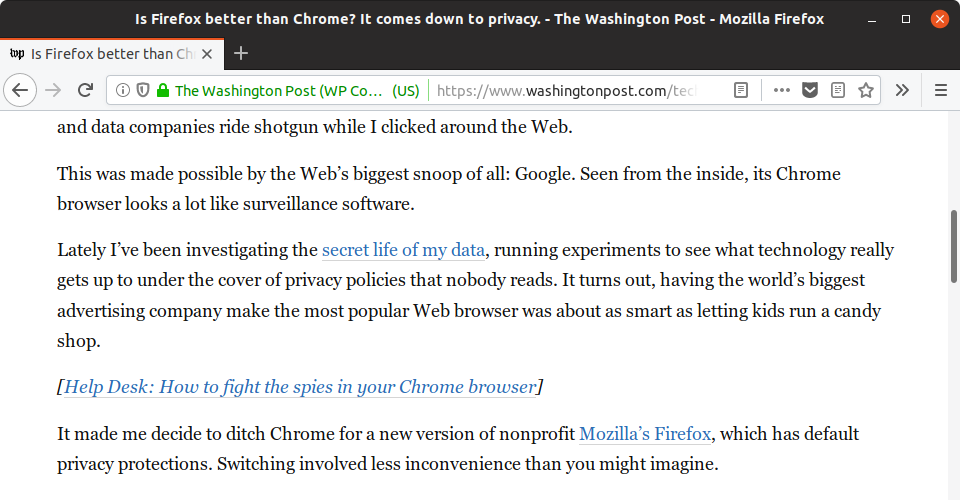

# Justify It

A Firefox extension to justify text in websites. There is a one-time setup for
every website, and it requires basic knowledge in HTML and CSS selectors.

*Without this extension*

*With this extension*

## How do I use this?

Navigate to the website you want to modify and click on the extension button.
In the popup type a CSS selector to apply the change. Either `p` or `article`
should work for 99% of websites!

This CSS selector will be remembered for this website and synced via your
Firefox account.
